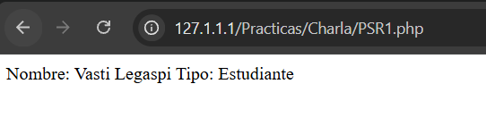
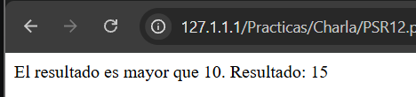

# PSR FUNDAMENTALES EN PHP

**Universidad Tecnológica de Panamá**  
**Facultad de Ingeniería de Sistemas Computacionales**

**Materia:** Desarrollo Web  
**Tema:** PSR Fundamentales  
**Fecha de ejecución:** 08 de octubre de 2026

---

# 🎯 Objetivos

- Comprender qué son los PSR y cuál es su importancia dentro del desarrollo de aplicaciones PHP.
- Identificar las características principales de **PSR-1, PSR-4 y PSR-12**.
- Implementar ejemplos prácticos de cada uno de los estándares estudiados.
- Comprender la función de los namespaces y la autocarga de clases mediante PSR-4.
- Aplicar buenas prácticas de organización, nomenclatura y formato en código PHP.
- Ejecutar los ejemplos y comprobar mediante sus resultados el funcionamiento de cada implementación.

---

# 📖 Introducción

PHP es un lenguaje de programación ampliamente utilizado para el desarrollo de aplicaciones web. Debido a que diferentes programadores pueden utilizar distintas formas de escribir y organizar su código, es importante contar con reglas que permitan mantener una estructura común.

Los **PSR (PHP Standards Recommendations)** son un conjunto de normas, guías y buenas prácticas creadas por el **PHP-FIG**, cuyo objetivo es establecer estándares para el desarrollo de aplicaciones PHP.

Dentro de los PSR estudiados se encuentran **PSR-1, PSR-4 y PSR-12**. PSR-1 establece reglas básicas para escribir código PHP, PSR-4 se enfoca en la autocarga de clases mediante namespaces y PSR-12 amplía las reglas de estilo para mantener un código uniforme y fácil de leer.

La utilización de estos estándares permite que el código sea más organizado, entendible y fácil de mantener cuando trabajan varias personas dentro de un mismo proyecto.

---

# ⚙️ Requisitos previos

Para realizar los ejemplos se utilizaron:

### Tecnologías utilizadas

- 🐘 **PHP 8.0 o superior**
- 📦 **Composer**
- 💻 **Visual Studio Code**
- 🖥️ **Windows 10 / 11**
- ⌨️ **Terminal / PowerShell**

---

# 📚 ¿Qué son los PSR?

Los **PSR (PHP Standards Recommendations)** son recomendaciones y estándares publicados por el **PHP-FIG (PHP Framework Interop Group)**.

Su propósito es establecer reglas comunes para que diferentes desarrolladores y proyectos puedan trabajar utilizando una estructura similar.

Los tres estándares utilizados en este trabajo son:

| PSR | Nombre | Función principal |
|---|---|---|
| **PSR-1** | Basic Coding Standard | Establece reglas básicas para escribir código PHP |
| **PSR-4** | Autoloading Standard | Permite cargar clases automáticamente |
| **PSR-12** | Extended Coding Style Guide | Define reglas más completas para el formato y estilo del código |

---

# 🟢 PSR-1 — Basic Coding Standard

PSR-1 establece reglas básicas para la escritura del código PHP.

Entre sus principales características se encuentran:

- Utilizar las etiquetas `<?php` y `<?=`.
- Utilizar codificación UTF-8 sin BOM.
- Utilizar nombres claros y consistentes.
- Las clases utilizan **StudlyCaps**.
- Las constantes se escriben en **MAYÚSCULAS**.
- Los métodos utilizan **camelCase**.
- Los archivos deben estar enfocados en declarar elementos o ejecutar acciones, evitando mezclar ambos propósitos.

Estas reglas buscan que el código compartido entre diferentes proyectos mantenga una estructura consistente.

## 💻 Ejemplo de PSR-1

Para comprobar algunas de estas reglas se realizó una clase `Usuario`.

### Archivo: `PSR1.php`

```php
<?php

class Usuario
{
    public const TIPO_USUARIO = 'Estudiante';

    private string $nombre;

    public function __construct(string $nombre)
    {
        $this->nombre = $nombre;
    }

    public function obtenerNombre(): string
    {
        return $this->nombre;
    }

    public function mostrarInformacion(): void
    {
        echo "Nombre: " . $this->obtenerNombre() . PHP_EOL;
        echo "Tipo: " . self::TIPO_USUARIO . PHP_EOL;
    }
}

$usuario = new Usuario('Vasti Legaspi');

$usuario->mostrarInformacion();
```

### ▶️ Ejecución

Desde la terminal:

```bash
php PSR1.php
```

### 📤 Resultado

```text
Nombre: Vasti Legaspi
Tipo: Estudiante
```

### 🖼️ Resultado final



En este ejemplo se pueden observar nombres como `Usuario`, que utiliza la nomenclatura de clase, `TIPO_USUARIO` para la constante y `obtenerNombre()` para el método.

---

# 🔵 PSR-4 — Autoloading Standard

PSR-4 establece una forma común de cargar automáticamente las clases a partir de su **namespace** y de la estructura de directorios.

Una de sus principales ventajas es que permite evitar tener que utilizar manualmente `require` o `include` para cada clase.

La relación utilizada en el ejemplo es:

```text
App\ → src/
```

Por lo tanto:

```text
App\Usuario
```

se encuentra en:

```text
src/Usuario.php
```

---

## 📁 Estructura del proyecto PSR-4

El proyecto se organizó de la siguiente manera:

```text
proyecto/
│
├── composer.json
├── index.php
│
└── src/
    └── Usuario.php
```

---

## 📄 Archivo `composer.json`

```json
{
    "autoload": {
        "psr-4": {
            "App\\": "src/"
        }
    }
}
```

Este archivo establece la relación entre el namespace `App` y la carpeta `src`.

---

## 📄 Archivo `src/Usuario.php`

```php
<?php

namespace App;

class Usuario
{
    private string $nombre;

    public function __construct(string $nombre)
    {
        $this->nombre = $nombre;
    }

    public function saludar(): string
    {
        return "Hola, soy " . $this->nombre;
    }
}
```

---

## 📄 Archivo `index.php`

```php
<?php

require __DIR__ . '/vendor/autoload.php';

use App\Usuario;

$usuario = new Usuario('Vasti');

echo $usuario->saludar();
```

---

## ▶️ Ejecución de PSR-4

Primero se ingresa a la carpeta del proyecto:

```bash
cd proyecto
```

Después se genera el autoloader de Composer:

```bash
composer dump-autoload
```

Finalmente se ejecuta:

```bash
php index.php
```

### 📤 Resultado

```text
Hola, soy Vasti
```

En este ejemplo se puede observar cómo el namespace `App` se relaciona con la carpeta `src`, permitiendo que las clases sean cargadas automáticamente mediante el autoloader.

---

# 🟣 PSR-12 — Extended Coding Style Guide

PSR-12 amplía las reglas relacionadas con el estilo y formato del código PHP.

Su objetivo es que diferentes programadores puedan trabajar con una estructura de código similar, facilitando la lectura y reduciendo diferencias entre proyectos.

Entre algunas de sus reglas se encuentran:

- Utilizar una indentación de **4 espacios**.
- Utilizar llaves `{}` en las estructuras de control.
- Mantener espacios adecuados en `if`, `for`, `while`, `foreach`, etc.
- Utilizar operadores con espacios adecuados.
- No colocar varias instrucciones en una misma línea.
- Mantener una estructura uniforme en clases, métodos y estructuras de control.
- Utilizar palabras clave de PHP en minúsculas.

---

## 💻 Ejemplo de PSR-12

### Archivo: `PSR12.php`

```php
<?php

class Calculadora
{
    public function sumar(int $numero1, int $numero2): int
    {
        return $numero1 + $numero2;
    }

    public function mostrarResultado(int $numero1, int $numero2): void
    {
        $resultado = $this->sumar($numero1, $numero2);

        if ($resultado > 10) {
            echo "El resultado es mayor que 10." . PHP_EOL;
        } else {
            echo "El resultado es 10 o menor." . PHP_EOL;
        }

        echo "Resultado: " . $resultado . PHP_EOL;
    }
}

$calculadora = new Calculadora();

$calculadora->mostrarResultado(7, 8);
```

### ▶️ Ejecución

```bash
php PSR12.php
```

### 📤 Resultado

```text
El resultado es mayor que 10.
Resultado: 15
```

### 🖼️ Resultado final



En este ejemplo se puede observar la indentación, el uso de espacios, las llaves en las estructuras de control y la separación de instrucciones.

---

# 🔄 Comparación de los tres PSR

| Característica | PSR-1 | PSR-4 | PSR-12 |
|---|:---:|:---:|:---:|
| Nombres de clases | ✅ | — | ✅ |
| Métodos camelCase | ✅ | — | ✅ |
| Constantes en mayúsculas | ✅ | — | — |
| Namespaces | — | ✅ | ✅ |
| Autocarga de clases | — | ✅ | — |
| Estructura de carpetas | — | ✅ | — |
| Indentación | — | — | ✅ |
| Formato de estructuras de control | — | — | ✅ |
| Organización del código | ✅ | ✅ | ✅ |

---

# 📦 Composer

**Composer** es un administrador de dependencias para PHP que permite gestionar paquetes y librerías desarrolladas por terceros.

En este trabajo Composer se utilizó principalmente para demostrar el funcionamiento de **PSR-4**, ya que permite generar el archivo de autoload que carga automáticamente las clases.

Para generar el autoloader se utiliza:

```bash
composer dump-autoload
```

Composer genera la carpeta:

```text
vendor/
```

y dentro de ella se encuentra el archivo:

```text
vendor/autoload.php
```

Este archivo posteriormente se carga desde `index.php`:

```php
require __DIR__ . '/vendor/autoload.php';
```

---

# ⚠️ Dificultades y soluciones

Durante la realización de los ejemplos se presentaron algunos problemas relacionados con la configuración del entorno.

### Error: PHP no reconocido

Si la terminal muestra un mensaje indicando que `php` no es reconocido como comando, se debe verificar que PHP esté instalado y agregado al PATH del sistema.

### Error: Composer no reconocido

Si el comando:

```bash
composer dump-autoload
```

no funciona, se debe verificar que Composer esté instalado correctamente.

### Error al cargar `vendor/autoload.php`

Si aparece un error relacionado con:

```text
vendor/autoload.php
```

se debe ejecutar:

```bash
composer install
```

o:

```bash
composer dump-autoload
```

Esto permite generar los archivos necesarios para la autocarga.

---

# 🎯 Objetivo del laboratorio

El objetivo de este laboratorio fue comprender y aplicar los estándares fundamentales de PHP mediante ejemplos prácticos.

Se implementaron ejemplos correspondientes a **PSR-1, PSR-4 y PSR-12**, comprobando mediante su ejecución cómo estos estándares ayudan a mantener un código organizado, consistente y fácil de mantener.

---

# 📝 Conclusión

Al realizar esta práctica pude comprender mejor que los PSR no son solamente reglas para que el código se vea ordenado, sino que buscan establecer una forma común de trabajar en proyectos PHP.

Con **PSR-1** pude observar reglas básicas como la forma de nombrar clases, métodos y constantes. Con **PSR-4** pude comprender mejor cómo funcionan los namespaces y la carga automática de clases mediante Composer. Finalmente, con **PSR-12** pude observar cómo se establecen reglas más específicas para mantener un formato uniforme en el código.

En general, considero que utilizar estos estándares facilita el trabajo cuando un proyecto es desarrollado por varias personas, ya que todos pueden seguir una misma estructura y resulta más sencillo leer, entender y mantener el código.

---

# 📚 Referencias

- PHP-FIG. (s. f.). *PHP Standards Recommendations*. PHP Framework Interop Group. https://www.php-fig.org/

- PHP-FIG. (s. f.). *PSR-1: Basic Coding Standard*. PHP Framework Interop Group. https://www.php-fig.org/psr/psr-1/

- PHP-FIG. (s. f.). *PSR-4: Autoloader*. PHP Framework Interop Group. https://www.php-fig.org/psr/psr-4/

- PHP-FIG. (s. f.). *PSR-12: Extended Coding Style Guide*. PHP Framework Interop Group. https://www.php-fig.org/psr/psr-12/

- Composer. (s. f.). *Composer*. https://getcomposer.org/

---

# 👤 Información del estudiante

**Universidad Tecnológica de Panamá**  
**Facultad de Ingeniería de Sistemas Computacionales**

**Materia:** Desarrollo Web  
**Tema:** PSR Fundamentales

**Estudiante:** Vasti Legaspi, Dylan Pitti, Andres Dommar, Samuel Orocú  
**Grupo:** 1S3122
